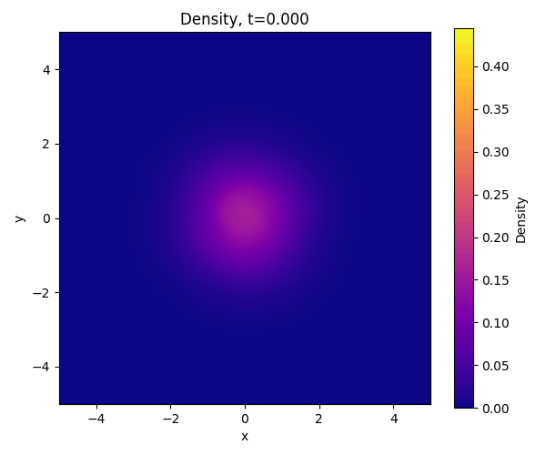

## Schrödinger Bridges as PINNs

One formulation of the Schrödinger bridge problem is the controlled stochastic differential equation:
$$
dX(t) = u(x,t)\, dt + \sqrt{2\epsilon}\, dW_t,
$$
where \(X(t)\) is a stochastic process in \(\mathbb{R}^d\), \(u(x,t)\) is the optimal control field, \(W_t\) is a standard Wiener process, and \(\epsilon\) is the noise scaling parameter; see Ref. [^1] for details. As discussed in Ref. [^1], the controlled optimal control problem can be equivalently formulated through a pair of dual Schrödinger potentials that satisfy the following PDE system:

$$
\begin{aligned}
\partial_t \varphi(x,t) &= -\,\epsilon\, \Delta \varphi(x,t), \\
\partial_t \hat{\varphi}(x,t) &= \epsilon\, \Delta \hat{\varphi}(x,t), \\
\varphi(x,0)\,\hat{\varphi}(x,0) &= \rho_0(x), \\
\varphi(x,1)\,\hat{\varphi}(x,1) &= \rho_1(x).
\end{aligned}
$$

The optimal drift is given by
$$
u(x,t) = 2\epsilon\, \nabla \log \varphi(x,t),
$$
and the time-marginal density is
$$
p(x,t) = \varphi(x,t)\, \hat{\varphi}(x,t).
$$

Because this formulation transforms the bridge problem into a coupled forward–backward heat flow, one can solve Schrödinger bridges using Physics-Informed Neural Networks (PINNs). The authors of Ref. [^2] also recognized this equivalence and applied PINNs to Schrödinger bridge problems in a more complex control setting.

The notebook `PINN_estimator_using_swiss_roll.ipynb` provides a toy example illustrating the use of PINNs for solving the Schrödinger bridge PDE system.

---

## Results

The accompanying notebook contains the relevant results. A key advantage of the PINN-based approach is that it recovers the full marginal density \(p(x,t)\), not just the drift field. The animation below illustrates an example of the inferred density evolution.

---

## Status and Findings

There are several advantages and numerous disadvantages to using a PINN-based approach as a Schrödinger bridge solver. These are summarized below.

### Pros

1. The formulation permits MLP-based representations of the drift field.
2. The method yields a learned neural approximation of the full time-varying marginal density.
3. Extensions to non-Euclidean manifolds are possible by replacing the Laplacian with the Laplace–Beltrami operator.

### Cons

1. The PDE residuals require computing Hessians, making the method computationally expensive and likely unsuitable for high-dimensional problems.
2. Training is substantially more complex compared with alternative approaches such as Ref. [^3], which are far easier to implement and train significantly faster. In practice, achieving an accurate drift remains challenging (see the notebook for illustrative plots).
3. Density estimates are required at the boundary conditions. While simple GMMs suffice for the toy examples, more expressive density estimators are needed for high-dimensional data such as images. As a result, the full system requires training two boundary density models in addition to the flow-field PINN.

---

## References

[^1]: Caluya, Kenneth F., and Abhishek Halder. *Wasserstein Proximal Algorithms for the Schrödinger Bridge Problem: Density Control with Nonlinear Drift.* **IEEE Transactions on Automatic Control**, 2021. doi:10.1109/TAC.2021.306070.

[^2]: Nodozi, Iman, Charlie Yan, Mira Khare, Abhishek Halder, and Ali Mesbah. “Neural Schrödinger Bridge with Sinkhorn Losses: Application to Data-driven Minimum Effort Control of Colloidal Self-assembly.” *arXiv preprint*, arXiv:2307.14442, 2023.

[^3]: Korotin, Alexander, Nikita Gushchin, and Evgeny Burnaev. “Light Schrödinger Bridge.” *International Conference on Learning Representations (ICLR)*, 2024.
